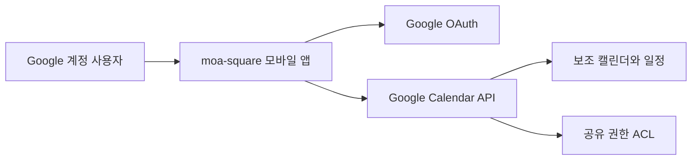

# moa-square 아키텍처 설계

## 설계 기준

초기 MVP는 모바일 앱이 Google OAuth로 사용자 승인을 받고 Google Calendar API를 사용하는 구조로 구현합니다. Google Calendar가 일정과 공유 권한의 원본이며 앱은 별도 일정 사본을 저장하지 않습니다.

- 모바일은 React Native + Expo + TypeScript를 사용합니다.
- 라우팅은 Expo Router를 사용합니다.
- 원격 조회와 캐시는 TanStack Query를 사용합니다.
- 인증은 Google OAuth 2.0을 사용하고 최소 권한 범위를 요청합니다.
- 공유 그룹은 Google 보조 캘린더로 표현합니다.
- 공유 권한은 Google Calendar ACL로 관리합니다.

## 전체 구조



앱은 인증된 사용자의 권한으로 Calendar API를 호출합니다. 일정과 권한 변경 결과는 Google Calendar에 직접 반영됩니다.

## 인증과 권한

Google OAuth 로그인과 Calendar 권한 동의를 하나의 연결 흐름으로 제공합니다. 앱은 기능에 필요한 최소 범위를 요청하고 토큰을 기기 보안 저장소에 보관합니다.

공개 앱에서 민감한 범위를 요청하면 Google의 검증이 필요할 수 있으므로 개발 초기에 OAuth 동의 화면과 배포 요건을 확인합니다. [Google Calendar API 인증 범위](https://developers.google.com/workspace/calendar/api/auth)

## 공유 그룹

공유 그룹 하나를 Google 보조 캘린더 하나로 표현합니다.

- 그룹 생성은 보조 캘린더 생성으로 처리합니다.
- 구성원 초대와 권한 변경은 ACL 생성·수정·삭제로 처리합니다.
- 일정 조회·수정 권한은 `reader`와 `writer`를 우선 사용합니다.
- 그룹 관리 권한은 MVP에서 캘린더 생성자가 담당합니다.
- 공유된 캘린더는 상대방 Calendar 목록에 자동으로 추가되지 않으므로 참여자가 자신의 목록에 추가하는 흐름을 제공합니다.

Google Calendar의 `owner` ACL 역할과 실제 데이터 소유자는 다릅니다. 소유권 이전과 생성자 탈퇴 범위는 실제 계정 유형에서 검증해야 합니다. [Google Calendar 공유](https://developers.google.com/workspace/calendar/api/concepts/sharing)

## 일정 모델

앱의 일정 모델은 Google Calendar Event 응답을 화면에 필요한 형태로 변환합니다. Google 이벤트 ID를 식별자로 사용하고 별도 로컬 ID 대응표를 만들지 않습니다.

- 일정 생성·수정·삭제는 Events API로 처리합니다.
- 종일 일정은 날짜 값으로 처리합니다.
- 시간 지정 일정은 시간대 정보를 유지합니다.
- 반복 일정과 회차 예외는 Google Calendar 표현을 보존합니다.
- 알림은 Google Calendar 이벤트의 reminder 기능을 사용합니다.

반복 일정의 ‘이번 일정만’, ‘이후 모든 일정’, ‘전체 일정’은 API 요청 방식이 다르므로 지원 범위를 구현 전에 검증합니다. [Google Calendar 반복 일정](https://developers.google.com/workspace/calendar/api/guides/recurringevents)

## 데이터 조회와 동기화

MVP는 다음 시점에 Calendar API를 다시 조회합니다.

- 앱을 실행하거나 일정 화면으로 돌아왔을 때 조회합니다.
- 일정이나 공유 설정을 변경한 뒤 관련 데이터를 무효화하고 다시 조회합니다.
- 사용자가 새로고침을 요청하면 조회합니다.

초기 전체 조회 이후에는 sync token을 사용한 증분 동기화를 적용합니다. 토큰이 만료되어 `410 Gone`이 반환되면 저장한 토큰을 폐기하고 전체 조회를 다시 수행합니다. sync token에는 데이터 본문이 없지만 앱 재실행에 필요하므로 기기에 저장할 수 있습니다. [Google Calendar 증분 동기화](https://developers.google.com/workspace/calendar/api/guides/sync)

Google의 푸시 알림은 변경 사실만 전달하고 일부 알림이 누락될 수 있으며 HTTPS 수신 서버가 필요합니다. MVP에는 포함하지 않고 사용성 검증 후 도입 여부를 결정합니다. [Google Calendar 푸시 알림](https://developers.google.com/workspace/calendar/api/guides/push)

## 로컬 상태

로컬에는 다음 정보만 저장합니다.

- 인증 토큰은 기기 보안 저장소에 저장합니다.
- sync token과 사용자가 선택한 표시·숨김 설정을 기기에 저장합니다.
- 일정과 ACL의 원본 데이터는 Google Calendar에 유지합니다.

화면 상태는 `useState`와 `useReducer`를 사용하고 간단한 전역 설정은 필요할 때 Context를 사용합니다. 추가 상태 관리 계층은 초기 도입하지 않습니다.

## 오류 처리

- 인증 만료 시 재인증 흐름을 제공합니다.
- 권한 부족은 해당 작업을 수행할 수 없다는 메시지로 표시합니다.
- API 요청 실패 시 사용자의 입력을 유지하고 재시도할 수 있게 합니다.
- API 제한 응답은 무한 재시도하지 않고 지수 백오프를 적용합니다.
- 변경 충돌은 Google Calendar의 버전·조건부 요청 지원 범위를 확인한 뒤 적용합니다.

## 코드 구성

```text
mobile/
└─ src/
   ├─ app/
   ├─ components/
   ├─ features/
   │  ├─ auth/
   │  ├─ calendars/
   │  └─ events/
   └─ services/
      ├─ google-auth.ts
      └─ google-calendar.ts
```

Google API 응답 변환과 화면 로직을 분리합니다. 공급자 추상화는 두 번째 공급자를 실제로 추가할 때 도입합니다.

## 개발과 배포

- 실제 Google 계정과 테스트 프로젝트를 분리합니다.
- OAuth 리디렉션은 iOS와 Android에서 각각 검증합니다.
- App Store·Google Play 배포와 EAS Build를 사용합니다.
- GitHub Actions에서 서식, 린트, 타입 검사와 단위 테스트를 실행합니다.
- 공개 배포 전에 Google OAuth 앱 검증과 개인정보처리방침 요건을 확인합니다.
