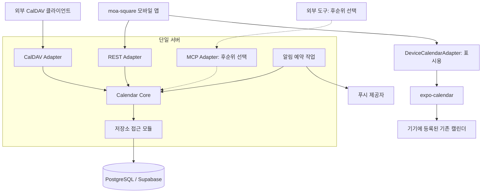

# moa-square 아키텍처 설계

## 설계 기준

Calendar Core와 REST·CalDAV Adapter를 단일 서버에 두고, MCP Adapter를 후순위 선택 기능으로 분리합니다. 기존 앱 → Supabase 직접 접근 구조는 이 설계로 대체합니다.

단일 서버는 공통 로직과 프로토콜 처리를 하나의 애플리케이션 배포 단위로 운영한다는 의미입니다. Core와 Adapter를 마이크로서비스로 분리하지 않습니다. 서버 프레임워크는 Fastify로 확정하고 Core는 프레임워크에 독립된 순수 TypeScript 모듈로 두어 Adapter만 얹습니다. DB와 인증은 PostgreSQL과 Supabase(내부 인프라)를 사용하고 푸시는 Expo Push를 사용합니다.

- Calendar Core, 단일 서버, REST·CalDAV의 역할은 확정된 방향입니다.
- expo-calendar의 기기 기존 일정 통합 표시 역할을 유지합니다.
- MCP는 초기 구현에서 생략하는 후순위 선택 기능입니다.
- React Native + Expo + TypeScript는 기존 모바일 권장안을 유지합니다.
- 서버 프레임워크는 Fastify, DB·인증은 PostgreSQL과 Supabase(내부 인프라)로 확정합니다.
- CalDAV 최초 출시는 읽기 전용으로 시작하고 쓰기는 왕복 검증 후 확장합니다.
- Core 데이터 모델은 초기부터 CalDAV 호환으로 설계하되 CalDAV Adapter 구현은 REST 완성 이후로 둡니다.

## 전체 구조

모든 자체 공유 일정의 조회·변경은 Calendar Core를 거칩니다. Adapter는 프로토콜 입출력을 변환하고, Core가 일정 규칙과 권한을 공통으로 처리합니다.



화살표는 호출 경로를 나타내며 응답은 같은 경로로 반환합니다. CalDAV의 허용된 수정은 복사본이 아닌 동일한 Core 일정에 반영합니다.

## Calendar Core

Calendar Core는 전송 프로토콜과 독립된 공통 일정 로직입니다. JSON·XML·iCalendar 변환은 Adapter에서 처리하고, 다음 규칙은 Core에서 일관되게 적용합니다.

- 그룹·멤버십·개인 전용 그룹·초대 수락과 권한을 관리합니다.
- 일정 CRUD와 날짜·시간·종일 일정의 유효성을 검사합니다.
- 반복 규칙·회차 예외·시간대와 기간별 조회를 처리합니다.
- 일정 버전과 동시 수정 충돌을 처리합니다.
- 개인별 그룹 표시·숨김과 알림 설정을 관리합니다.
- 변경에 따른 알림 예약 갱신에 필요한 상태를 저장합니다.

인증 계층은 자격 증명을 검증해 내부 구성원 식별자로 연결합니다. Core는 식별자와 요청의 접근 범위를 받아 현재 멤버십을 검사합니다. Adapter가 DB를 직접 변경하거나 별도 권한 규칙을 복제하지 않습니다.

## REST Adapter

REST는 모바일 앱의 기본 서버 인터페이스입니다. 그룹·초대·일정·개인 설정 요청을 Core 호출로 변환하고 결과를 JSON과 HTTP 응답으로 반환합니다. 버전 등 충돌 감지에 필요한 정보도 전달합니다.

TanStack Query는 REST 응답의 조회·캐시를 관리합니다. 일정용 DB SDK와 Supabase Realtime 직접 구독은 기본 경로에서 제외합니다. 초기 변경 반영은 화면 복귀·변경 후 재조회로 시작할 수 있으며 지속 연결의 필요성과 방식, 정확한 API 명세는 미결정입니다.

## CalDAV Adapter

CalDAV는 moa-square의 자체 공유 캘린더를 외부 캘린더 클라이언트에 제공하는 표준 인터페이스입니다. 외부 클라이언트가 moa-square 서버에 연결하도록 합니다. Google·iCloud·Samsung 계정 서버로 일정을 자동 복제하는 기능은 포함하지 않습니다.

CalDAV는 WebDAV 기반의 캘린더 접근 규약이며 iCalendar 일정 데이터를 사용합니다. [RFC 4791](https://www.rfc-editor.org/rfc/rfc4791), [RFC 5545](https://www.rfc-editor.org/rfc/rfc5545)

- 접근 가능한 그룹을 캘린더 컬렉션으로 제공하는 방식을 권장합니다.
- 탐색·조회·변경 요청을 Core 호출로 변환합니다.
- Core 일정과 iCalendar 사이의 데이터 변환을 담당합니다.
- 리소스 URL·UID·ETag와 Core 식별자·버전을 일관되게 연결합니다.
- 허용된 외부 수정에도 공통 권한·충돌·알림 갱신 규칙을 적용합니다.

컬렉션 탐색, 기간 조회, 조건부 변경과 삭제 반영을 지원 범위에 맞게 구현해야 합니다. WebDAV sync-token 기반 증분 동기화는 채택 여부를 별도로 정하고, 채택하면 토큰 만료·전체 재조회·삭제 변경 이력도 설계합니다. [RFC 6578](https://www.rfc-editor.org/rfc/rfc6578)

CalDAV는 단순 ICS 파일 다운로드와 구분합니다. 최초 출시는 읽기 전용으로 시작하고 쓰기는 iCalendar 왕복 변환과 충돌 검증을 마친 뒤 확장합니다. 지원 클라이언트 범위는 실기기 검증 후 확정합니다. Core 데이터 모델은 초기부터 CalDAV 호환으로 설계하되 이 Adapter의 구현은 REST 완성 이후로 둡니다. 자체 캘린더의 표준 제공 경로를 CalDAV로 두는 방향은 유지합니다.

## MCP Adapter

MCP는 Core 기능을 외부 도구에 제공할 필요가 확인될 때 추가합니다. 초기 배포·앱 사용·출시 조건에 포함하지 않고 기본 메뉴에 AI 기능을 추가하지 않습니다.

도입하면 같은 단일 서버에서 Core를 호출하며 데이터 모델과 권한을 재사용합니다. 제공할 기능, 인증과 변경 승인 범위는 도입 시 결정합니다. 현재는 확장 지점만 문서화하고 구현은 요구하지 않습니다.

## expo-calendar와 데이터 원본

expo-calendar는 기기에 등록된 기존 일정을 읽어 앱 화면에 함께 표시합니다. 자체 일정의 서버 접근이나 CalDAV 제공을 대신하지 않습니다.

| 데이터                      | 원본과 관리 경로                        | 앱 처리                          |
| --------------------------- | --------------------------------------- | -------------------------------- |
| 자체 공유 일정              | Calendar Core가 서버 DB에서 관리합니다. | REST로 조회·변경합니다.          |
| 기기의 기존 외부 일정       | 해당 외부 캘린더가 원본입니다.          | expo-calendar로 읽어 표시합니다. |
| CalDAV에서 접근한 자체 일정 | 동일한 Core 일정이 원본입니다.          | 같은 변경을 REST로 조회합니다.   |

기기 기존 일정을 자동 업로드하거나 그룹에 복사하지 않습니다. 기존 외부 일정의 직접 수정과 일회성 그룹 복사는 초기 범위에서 제외합니다.

CalDAV로 기기에 연결된 자체 일정이 expo-calendar에도 나타나면 REST 일정과 중복될 수 있습니다. 해당 기기 캘린더를 통합 표시에서 제외하는 방식을 우선 권장합니다. 이름만으로 동일성을 판단하지 않으며 식별과 기기별 선택 저장 방식은 실기기로 검증해야 합니다.

## 저장소와 논리 모델

데이터는 서버의 저장소 접근 모듈을 통해 관리합니다. DB는 PostgreSQL, 인증은 Supabase로 확정하며 Supabase는 서버 내부 인프라로만 취급하고 앱은 REST를 통해서만 접근합니다. RLS는 보조 방어로 검토하며 Core의 권한 검사를 대체하지 않습니다.

아래는 논리적 저장 요구사항이며 테이블 분리나 타입을 확정한 스키마가 아닙니다.

| 항목               | 저장할 의미                                                                      |
| ------------------ | -------------------------------------------------------------------------------- |
| 구성원·그룹·멤버십 | 내부 구성원 식별자, 그룹 이름·색상, 역할과 소유 관계를 저장합니다.               |
| 초대               | 대상 그룹, 만료·취소·수락 상태를 관리합니다.                                     |
| 일정               | 그룹, 제목, 시각 또는 날짜 범위, 시간대, 메모, 라벨, 작성자와 버전을 저장합니다. |
| 반복·예외          | 반복 규칙·종료 조건과 특정 회차의 수정·취소를 표현합니다.                        |
| 개인 설정          | 그룹 표시·숨김과 개인별 알림 설정을 저장합니다.                                  |
| 알림               | 기기 토큰, 발송 시점과 처리 상태를 관리합니다.                                   |
| CalDAV 리소스      | UID·리소스 경로와 Core 일정의 대응, 변경 버전을 관리합니다.                      |

종일 일정은 날짜 범위로 다루고 시간 지정 일정은 기준 시간대를 보존합니다. 반복 원본과 회차 예외는 CalDAV 왕복 변환에도 의미가 유지되어야 합니다. 지원하지 않는 속성의 처리와 실제 저장·직렬화 방식은 후속 결정합니다.

## 알림과 운영

공유 일정 알림은 서버가 발송 시점을 관리합니다. 상시 구동되는 단일 서버의 내장 스케줄러가 DB에 저장된 예약 상태를 기준으로 발송하며, 앱 실행 여부에 따라 신규 알림 예약이 누락되는 구조에 의존하지 않습니다.

- REST·CalDAV 변경 모두 같은 예약 갱신 경로를 거칩니다.
- 수정·삭제·탈퇴에 따라 발송 대상과 시점을 갱신합니다.
- 재시작 후 복구와 중복 발송 방지를 위한 상태를 관리합니다.
- expo-notifications는 모바일 알림 수신에 활용합니다.
- CalDAV 클라이언트 자체 알림과 앱 푸시의 중복 정책을 정해야 합니다.

예약 실행은 상시 서버의 내장 스케줄러, 푸시는 Expo Push로 확정합니다. 재시도 정책과 CalDAV 클라이언트 자체 알림과의 중복 처리 정책은 미결정입니다. 별도 작업 서버나 메시지 브로커는 초기 필수 요소로 추가하지 않습니다.

## 코드 구성과 개발 도구

다음은 책임을 설명하는 권장 구조이며 실제 코드를 생성한 상태가 아닙니다. Core를 별도 서비스나 패키지로 배포하지 않아도 됩니다.

```text
moa-square/
├─ mobile/
│  └─ src/
│     ├─ app/
│     ├─ components/
│     ├─ features/
│     └─ services/
│        ├─ api-client.ts
│        └─ device-calendar.ts
├─ server/
│  └─ src/
│     ├─ calendar-core/
│     ├─ adapters/
│     │  ├─ rest/
│     │  └─ caldav/
│     ├─ persistence/
│     └─ jobs/
└─ docs/
```

MCP 폴더는 도입 시 추가합니다. 화면 상태는 useState·useReducer, 간단한 전역 설정은 필요할 때 Context를 사용하고 추가 상태 관리 계층은 초기 도입하지 않습니다.

- 모바일 라우팅은 Expo Router를 권장합니다.
- Node.js LTS와 pnpm은 기존 개발 환경 후보로 유지합니다.
- Apple·Google 로그인은 후보로 유지하되 CalDAV 접속 인증은 별도로 설계합니다.
- App Store·Google Play 배포와 EAS Build·GitHub Actions 활용 방향을 유지합니다.
- VS Code, Xcode·Android Studio와 실제 iPhone·Galaxy를 개발 도구 후보로 유지합니다.
- Vitest 또는 Jest와 React Native Testing Library를 테스트 도구 후보로 유지합니다.
- Sentry는 출시 전 오류 추적 후보로 유지합니다.

서버 프레임워크는 Fastify로 확정하며, 상시 서버 구동을 전제로 호스팅 환경은 별도로 선택합니다. Supabase는 DB·인증 인프라로 사용하고 Edge Functions는 필수 도구로 두지 않습니다. expo-calendar의 개발 환경은 선택한 Expo SDK 공식 문서와 실기기를 기준으로 확인합니다. [Expo Calendar 문서](https://docs.expo.dev/versions/latest/sdk/calendar/)

## 범위

다중 그룹, 일정 CRUD·종일·반복·알림·메모·라벨, 표시·숨김, 쉬운 가입·초대는 필수 요구사항으로 유지합니다. CalDAV는 표준 제공 인터페이스로 설계하며 최초 공개는 읽기 전용으로 시작하고 쓰기와 지원 클라이언트 범위는 검증 후 확장합니다.

- MCP는 후순위 선택 기능으로 둡니다.
- 공급자 서버 직접 동기화와 기기 기존 일정 쓰기는 초기 제외합니다.
- 웹앱·태블릿 전용 UI·Galaxy Store 배포는 초기 제외합니다.
- 댓글·채팅·사진·투표·피드·불필요한 AI 기능은 제품 제외 방침을 유지합니다.
- 마이크로서비스, GraphQL과 복잡한 권한 단계는 초기 도입하지 않습니다.

세부 판단과 검증 항목은 [적합성 검토](./design-review.md)에 기록합니다.
